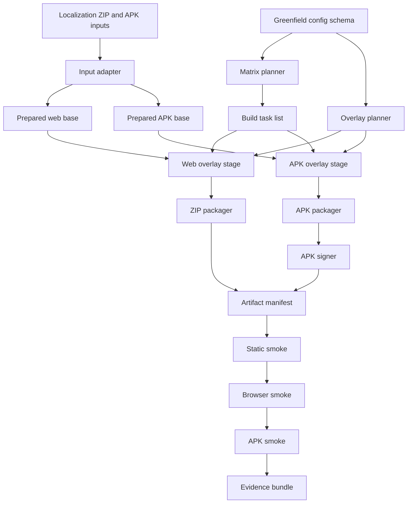

# Greenfield design spike

This document records the design-only spike for a possible future packaging
project that starts from Chinese localization artifacts instead of the current
DoL-Lyra/Lyra-derived build base.

The current DOL-X repository remains the official production line during this
spike. This document is not a migration plan and does not change build logic,
default build codes, mod entries, workflows, or candidate gates.

Greenfield work is a disposable design spike, not the next DOL-X mainline.
Any prototype or repository split must pass a separate go/no-go decision before
it can replace the current DOL-X release process.

## 1. Production boundary to protect

The current repository continues to own real releases until a separate
greenfield prototype can prove equivalent build and runtime evidence.

Do not break or silently change these boundaries:

| Boundary | Current contract | Why it matters |
|---|---|---|
| Stable build matrix | `24834`, `25858`, `26882`, `28930` in `config/combinations.toml` | Keeps the known self-use release set stable. |
| Base combination | `24834` | Stable base package: UCB plus local cheat/CSD stack plus more-love plus custom-spellbook. |
| Recommended variants | `25858`, `26882`, `28930` | AU-F, AU-M, and AU-A remain explicit variants. |
| Polyfill | disabled | Avoids restoring old online/polyfill variants by accident. |
| XFox identity | `config/build.toml` identity, APK display name, package name, and APK replacements | Allows coexistence with upstream/localization APKs and keeps self-use identity config-driven. |
| Project-local rollback mods | BJX/BCCM and other old local cheat/CSD entries remain available for rollback | They are project-local legacy/rollback entries, not upstream legacy. |
| Candidate framework work | cheatExtended/maplebirch remains candidate-only | Prevents accidental default migration. |
| Simple Framework | future mutually exclusive provider only | Not part of the current B1/B2 gate. |
| CI production path | existing build, compatibility, artifact upload, and release workflows | Keeps real ZIP/APK production working. |
| Runtime evidence | current HTML, browser, APK WebView/CDP smoke tools and reports | Avoids losing automated evidence that artifacts can enter the game. |
| Candidate gate | manual B1/B2 baseline candidate gate and promotion rules | Keeps candidate promotion separate from ordinary builds. |

The sync model remains:

```text
Vrelnir DoL
  -> Chinese localization artifacts
  -> DoL-Lyra/Lyra packaging flow
  -> DOL-X XFox self-use integration
```

For this spike, the future greenfield project investigates whether the middle
packaging layer can be replaced by a smaller purpose-built packager. It does
not replace the current production line.

The default next step for real releases remains DOL-X work on top of the current
sync-friendly upstream flow.  Greenfield design is only retained as an option if
it later proves simpler and safer than continuing the current production line.

## 2. Greenfield input interface

The greenfield project should start from explicit input artifacts rather than
implicitly depending on the current Lyra downloader and workspace layout.

### 2.1 Required content inputs

| Input | Required | Description | Validation |
|---|---|---|---|
| `localized_zip` | yes | Chinese-localized web/ZIP build or extracted web root. | Must contain an HTML entry point and game assets. |
| `localized_apk` | yes for APK output | Chinese-localized APK used as Android base. | Must contain `assets/www/index.html` or equivalent WebView root. |
| `version_manifest` | yes | DOL version, localization version, source tag/SHA, build date. | Must be machine-readable and included in output manifest. |
| `original_imagepack` | yes if base artifact lacks images | Original image pack used to fill package assets. | Must be a ZIP/archive or extracted directory with expected image paths. |
| `extra_imagepacks` | optional | UCB/BESC/Hikari/Goose or future image overlays. | Must declare overlay order and case-fix behavior. |
| `base_mods` | yes | Built-in mods such as ModLoader GUI, i18n, cheat, CSD. | Must declare injection mode and fail-fast policy. |
| `modloader_mods` | optional | Feature-gated `.mod.zip` payloads for AU, more-love, custom-spellbook, candidates, etc. | Must include source, expected filename, feature binding, and checksum policy. |
| `apk_tools` | yes for APK output | apktool/signing or future source-build toolchain. | Tool versions must be pinned or recorded. |
| `signing_material` | yes for release APK output | Keystore path or CI secret references. | Secrets must not be stored in repository plaintext. |

### 2.2 Input adapter contract

The first greenfield module should normalize every source into a local input
bundle:

```text
input-bundle/
  manifest.json
  web/
    index.html
    img/
    ...
  apk/
    source.apk
  resources/
    imagepacks/
    base-mods/
    modloader-mods/
  tools/
    apktool.jar
    signer.jar
```

The rest of the pipeline should consume only this bundle and the new
configuration schema. This prevents a future packager from hardcoding GitHub
release names, current DOL-X workspace paths, or Lyra-specific assumptions.

## 3. Greenfield configuration schema draft

The design goal is one project-level configuration model that can express the
current XFox release policy without importing Lyra code or current tests.

The exact file format can be TOML or YAML. TOML is recommended because the
current repository already uses TOML for build configuration, but field names
should be greenfield-owned.

```toml
[project]
name = "XFox"
artifact_prefix = "DoL"
description = "Self-use integrated package"

[identity]
display_name = "DoL XFox"
package_name = "com.vrelnir.dol.xfox"
artifact_identity = "XFox"

[[apk.replacements]]
path = "AndroidManifest.xml"
pattern = '"com.vrelnir.dol"'
replacement = '"com.vrelnir.dol.xfox"'

[signing]
mode = "ci-secret"
keystore_env = "DOL_KEYSTORE_BASE64"
keystore_password_env = "DOL_KEYSTORE_PASSWORD"
key_alias_env = "DOL_KEY_ALIAS"
key_password_env = "DOL_KEY_PASSWORD"

[[features]]
id = "cheat_csd"
bit = 2
required = true
description = "Project-local stable cheat/CSD stack"

[[features]]
id = "ucb"
bit = 256

[[features]]
id = "au-f"
bit = 1024
conflicts = ["au-m", "au-a", "besc", "goose", "susato"]

[[features]]
id = "more_love"
bit = 8192

[[features]]
id = "custom_spellbook"
bit = 16384

[[features]]
id = "cheat_extended_maplebirch"
bit = 32768
channel = "candidate"

[matrix]
stable_codes = [24834, 25858, 26882, 28930]
base_code = 24834
recommended_codes = [25858, 26882, 28930]
polyfill_enabled = false

[[imagepacks]]
id = "ucb"
feature = "ucb"
source = "gitgud-archive"
overlay_order = 100
case_fixes = []

[[base_mods]]
id = "modloader_gui"
required = true
source = "github-release"
inject_mode = "replace"
replace_slot = 0

[[modloader_mods]]
id = "au_face"
features_any = ["au-f", "au-m", "au-a"]
source = "github-release"
asset_pattern = "AUsDoL.facial.expansion.mod.zip"

[[smoke_profiles]]
id = "stable"
required_features = ["cheat_csd", "ucb", "more_love", "custom_spellbook"]
forbidden_features = ["cheat_extended_maplebirch"]
entry_passage = "Orphanage Intro"

[[smoke_profiles]]
id = "candidate-maplebirch"
required_features = ["ucb", "more_love", "custom_spellbook", "cheat_extended_maplebirch"]
channel = "candidate"
```

Schema rules:

- Feature bits are stable compatibility contracts; changing them invalidates
  existing build codes.
- Stable matrix and candidate matrix must be separate fields.
- Signing config must reference secret names, not concrete secret values.
- Project-local legacy/rollback entries should be labeled as rollback or
  legacy-local, never upstream legacy.
- Framework providers should be mutually exclusive by schema, not by comments
  alone.
- Smoke profiles should be first-class config so package identity and expected
  feature set cannot drift from build matrix policy.

## 4. Greenfield pipeline boundary

The greenfield packager should be organized as a set of explicit stages with
JSON manifests between stages. The manifests are part of the design because the
new project cannot rely on current Lyra stateful workspace conventions.



Stage responsibilities:

| Stage | Responsibilities | Must not do |
|---|---|---|
| Input adapter | Locate or download declared inputs, normalize directories, write source manifest. | Decide build matrix or mutate identity. |
| Prepare web base | Validate HTML entry point, merge required base assets, prepare mod injection target. | Inject feature-gated mods. |
| Prepare APK base | Decompile or unpack APK, apply identity replacements, expose WebView root. | Sign final APK or choose feature set. |
| Matrix planner | Convert feature config and build codes into build tasks. | Download resources. |
| Overlay planner | Resolve imagepack, base mod, and modloader mod order for each task. | Recalculate feature bits. |
| Web overlay | Apply image overlays and inject selected modloader mods. | Package ZIP. |
| APK overlay | Apply same overlays to APK WebView root. | Sign APK. |
| ZIP packager | Produce stable output ZIP and hash. | Run runtime smoke. |
| APK packager | Rebuild APK with selected content. | Embed signing secrets. |
| APK signer | Sign final APK from secret references. | Change package contents after signing. |
| Static smoke | Check artifact structure and embedded mod payloads. | Claim runtime playability. |
| Browser smoke | Verify desktop browser boot and enter-game behavior. | Claim Android WebView coverage. |
| APK smoke | Verify Android emulator install, launch, WebView/CDP, and enter-game behavior. | Claim HarmonyOS/Huawei certification. |

## 5. New minimum smoke requirements

Because this spike assumes no reuse of current smoke tools, the greenfield
project must design replacement checks before it writes a prototype.

### 5.1 Static HTML and package smoke

Minimum checks:

- Artifact exists and has deterministic name.
- ZIP contains an HTML entry point.
- APK contains a WebView HTML entry point.
- HTML contains a mod payload list or the new equivalent injection structure.
- Embedded mod payloads are parseable.
- Embedded ZIP payloads are valid ZIPs.
- Mod metadata such as `boot.json` is present when expected.
- Required stable features are present in stable artifacts.
- Candidate-only features are absent from stable artifacts.
- Package slug/profile matches the selected smoke profile.
- APK manifest package name and display name match XFox identity.

### 5.2 Browser smoke

Minimum checks:

- Serve the artifact over local HTTP, not `file://`.
- Open the HTML in a real browser engine.
- Capture console errors, page errors, failed requests, dialogs, popups, and screenshots.
- Automatically handle known startup confirmations and password prompts when configured.
- Confirm SugarCube or the new game runtime becomes available.
- Confirm the current passage reaches a known playable or near-playable state.
- Attempt Enter Game and record before/after passage.
- Classify high-risk findings such as `ReferenceError`, `TypeError`, Twine user-script failures,
  missing framework globals, image-layer load failures, and blocked startup dialogs.
- Emit JSON summary and human-readable Markdown report.

### 5.3 APK smoke

Minimum checks:

- Install APK on a GitHub-hosted Android emulator.
- Launch the package by package name.
- Attach to Android WebView through DevTools/CDP or a new equivalent mechanism.
- Reuse the same runtime success criteria as browser smoke.
- Record ADB commands, install/launch result, logcat excerpt, WebView socket discovery, screenshot,
  and structured JSON diagnostics.
- Scope the claim as Android emulator/WebView evidence only. Do not claim Huawei, Honor, HarmonyOS 5,
  HarmonyOS 6, HarmonyOS NEXT, or manual phone certification from this automated run.

### 5.4 Smoke success definition

A greenfield artifact is not considered smoke-green unless all of these are
true:

- Static package checks pass.
- No high-risk runtime findings are present.
- Browser boot succeeds.
- Game runtime reaches a ready state.
- Enter Game succeeds or reaches an explicitly approved playable passage.
- Package identity and smoke profile match.
- APK smoke succeeds for APK artifacts.

## 6. Go/no-go gate from design to prototype

The design spike should enter a prototype phase only if all go criteria are met
and no hard no-go condition applies.

### 6.1 Go criteria

- The input adapter can be specified without depending on current Lyra workspace layout.
- The config schema can represent the current XFox stable matrix and candidate separation clearly.
- The APK path is realistic, including package replacement, rebuild, signing, and emulator smoke.
- The new smoke plan can cover static, browser, and APK evidence without copying current smoke code.
- The first prototype can be limited to one stable base ZIP and one stable base APK.
- Current DOL-X production releases can continue unchanged during prototype work.
- The prototype can be deleted without affecting current releases if it fails.

### 6.2 No-go criteria

- The new packager needs to rebuild most of current Lyra behavior before producing one artifact.
- APK signing or WebView runtime validation cannot be designed safely.
- Smoke coverage would be weaker than current production evidence for a long period.
- The design requires changing current default build codes or removing rollback mod entries.
- The design mixes candidate cheatExtended/maplebirch into stable artifacts.
- The design depends on manual phone testing as the primary safety gate.

### 6.3 Prototype entry scope if go is approved

The next phase, if approved later, should still be minimal:

1. One stable base ZIP from explicit localization input.
2. One stable base APK from explicit localization input.
3. XFox identity applied.
4. Static smoke from scratch.
5. Browser smoke from scratch.
6. APK emulator smoke from scratch.
7. No AU variants.
8. No cheatExtended/maplebirch.
9. No Simple Framework.
10. No replacement of current production workflow.

## 7. Decision summary

The current best route is a controlled dual-track strategy:

- Keep DOL-X/Lyra as the production packager.
- Treat greenfield work as a disposable design spike first.
- Require explicit go/no-go approval before any prototype code.
- Require prototype parity evidence before considering migration.

Until those gates are satisfied, the current repository remains the source of
truth for self-use XFox ZIP/APK releases.
