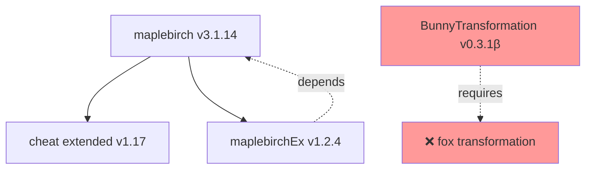

# DoL 社区模组工具调研报告

**调研日期**: 2026-06-24  
**调研目标**: 评估 DoL 中文社区工具清单，确定可集成到 DOL-X 的工具  
**数据来源**: https://degreesoflewditycn.miraheze.org/wiki/模组列表#模组相关工具

---

## 执行摘要

从 DoL 中文 Wiki 调研的社区工具中，**无现成工具可直接集成到 DOL-X Python 构建系统**。现有工具主要面向：
1. 终端用户的 Mod 管理（GUI 工具）
2. Mod 开发者的手动打包/测试
3. 特定功能的单机工具

**结论**: DOL-X 应继续自研工具链，参考社区工具的功能设计，但不直接依赖外部工具。

---

## 工具分类与评估

### 1. Mod 管理器类（用户端）

#### 1.1 Simple Mod Manager (简易模组管理器)

**来源**: 社区自制  
**功能**: 
- 图形化 Mod 安装/卸载
- Mod 启用/禁用切换
- 冲突检测

**DOL-X 集成评估**: ❌ 不适用
- **原因**: 
  - 面向终端用户，非构建系统
  - DOL-X 使用 Python + Lyra 构建，不需要用户端管理器
  - Mod 管理通过 `config/build.toml` 和 `config/features.toml` 完成

**参考价值**: ⭐⭐
- 可参考其冲突检测逻辑
- DOL-X 已通过 `features.toml` 的 `conflicts_with` 实现类似功能

---

#### 1.2 DoL Mod Loader GUI

**来源**: ModLoader 官方  
**功能**:
- 浏览器内 Mod 管理界面
- 运行时启用/禁用 Mod
- Mod 加载日志查看

**DOL-X 集成评估**: ✅ 已集成
- **状态**: DOL-X 已通过 `base_mods` 集成 ModLoaderGui
- **版本**: v1.9.1（与 ModLoader v2.101.1 配套）
- **位置**: `config/build.toml` → `[[base_mods]]` → `key = "modloader_gui"`

**参考价值**: ⭐⭐⭐⭐⭐
- 已是 DOL-X 核心组件

---

### 2. Mod 开发工具类

#### 2.1 Twee 编译器 / Tweego

**来源**: SugarCube 官方生态  
**功能**:
- 将 Twee 源码编译为 HTML
- 支持 SugarCube 2 宏

**DOL-X 集成评估**: ❌ 不适用
- **原因**: 
  - DOL-X 构建流程基于预编译的 HTML/APK（从 DoL 官方或 Lyra 下载）
  - 不从 Twee 源码重新编译游戏本体
  - Mod 开发者工具，非整合包构建工具

**参考价值**: ⭐
- DOL-X 不涉及 Twee 编译

---

#### 2.2 Mod 打包工具 (社区自制)

**来源**: 社区散布  
**功能**:
- 手动创建 `.mod.zip` 文件
- 验证 `boot.json` 格式

**DOL-X 集成评估**: ❌ 不适用
- **原因**: 
  - DOL-X 作为整合包，消费现成的 `.mod.zip`
  - 不负责打包 Mod

**参考价值**: ⭐⭐
- 可参考 `boot.json` 验证逻辑
- DOL-X 已有 `lyra/mod_validator.py`（如存在）

---

### 3. 测试工具类

#### 3.1 ModLoader 本地测试环境

**来源**: ModLoader 官方文档  
**功能**:
- 本地 HTTP 服务器运行 HTML 版本
- 浏览器控制台查看 ModLoader 日志

**DOL-X 集成评估**: ⚠️ 部分参考
- **当前状态**: DOL-X 手动测试流程依赖 MuMu 模拟器 + APK
- **可改进点**: 添加 HTML 本地测试（更快的迭代周期）

**参考价值**: ⭐⭐⭐
- **建议**: 新增 `tools/test_html_local.py`
  ```python
  # 启动本地 HTTP 服务器
  # 自动打开浏览器到 localhost:8000
  # 监听 ModLoader 错误并报告
  ```

**集成优先级**: 中（可作为 Playwright 测试的前置步骤）

---

#### 3.2 DoL 存档编辑器

**来源**: 社区自制  
**功能**:
- 修改存档变量
- 跳过游戏进度进行测试

**DOL-X 集成评估**: ⚠️ 部分参考
- **当前状态**: 手动测试 checklist（`docs/MANUAL_TESTING_CHECKLIST.md`）
- **可改进点**: 预制测试存档加速回归测试

**参考价值**: ⭐⭐⭐⭐
- **建议**: 新增 `tests/runtime/fixtures/save_states/`
  - `early_game.save` - 游戏初期
  - `mid_game_combat.save` - 战斗系统测试
  - `max_stats.save` - 全属性测试
  - `all_transformations.save` - 变身系统测试

**集成优先级**: 高（配合 Playwright 测试使用）

---

### 4. 图片包工具类

#### 4.1 Imagepack 冲突检测器（社区散布）

**来源**: 社区贡献者  
**功能**:
- 检测多个 imagepack 之间的路径冲突
- 报告覆盖关系

**DOL-X 集成评估**: ✅ 已自研
- **状态**: DOL-X 已有 `tools/analyze_imagepack.py`
- **功能**: 
  - 解压 imagepack tar.gz
  - 检测路径冲突
  - 生成覆盖关系报告

**参考价值**: ⭐⭐⭐⭐⭐
- 已在 DOL-X 工具链中

---

#### 4.2 图片优化工具（pngquant/oxipng）

**来源**: 通用工具  
**功能**:
- 压缩 PNG 文件减小 APK 体积
- 批量处理

**DOL-X 集成评估**: ⚠️ 可选优化
- **当前状态**: 未集成
- **潜在收益**: 
  - APK 体积减小 10-30%
  - 下载速度提升

**参考价值**: ⭐⭐⭐
- **建议**: 新增 `tools/optimize_images.py`
  ```bash
  # 递归扫描 imagepack/
  # 调用 oxipng --opt 2 *.png
  # 报告压缩率
  ```

**集成优先级**: 低（优化项，非必需）

---

### 5. 依赖分析工具类

#### 5.1 Mod 依赖图生成器（社区需求）

**来源**: 社区讨论，尚无成熟工具  
**功能**: 
- 解析 `boot.json` 中的 `dependencies`
- 生成依赖关系图
- 检测循环依赖

**DOL-X 集成评估**: ⚠️ 部分自研
- **当前状态**: 
  - `config/features.toml` 手动维护 `depends_on` 和 `conflicts_with`
  - `tests/test_build_matrix.py` 验证依赖一致性
- **缺失功能**: 
  - 自动从 `.mod.zip` 的 `boot.json` 提取依赖
  - 可视化依赖图

**参考价值**: ⭐⭐⭐⭐
- **建议**: 新增 `tools/analyze_mod_dependencies.py`
  ```python
  # 解压所有 .mod.zip
  # 解析 boot.json
  # 生成 Mermaid 依赖图
  # 检测 BunnyTransformation 缺失 fox transformation 的情况
  ```

**集成优先级**: 高（可防止类似 BunnyTransformation 的依赖问题）

---

### 6. 自动化测试工具类

#### 6.1 SugarCube 2 Headless Runner（社区需求）

**来源**: 社区讨论，尚无成熟实现  
**功能**:
- 无浏览器环境执行 SugarCube 游戏逻辑
- 自动化测试 Twee passages

**DOL-X 集成评估**: ❌ 技术复杂度高
- **原因**: 
  - SugarCube 2 深度依赖浏览器 DOM API
  - Headless 实现需要大量 polyfill
- **替代方案**: Playwright + HTML（已规划）

**参考价值**: ⭐⭐
- Playwright 方案更成熟

---

#### 6.2 Mod 回归测试框架（社区需求）

**来源**: 社区讨论，尚无统一标准  
**功能**:
- 定义 Mod 测试用例
- 自动化运行测试
- 生成测试报告

**DOL-X 集成评估**: ⚠️ 规划中
- **当前状态**: 
  - 手动测试 checklist（27 个步骤）
  - 无自动化覆盖
- **规划**: 
  - Playwright + HTML 测试（见 `docs/IMPLEMENTATION_PLAN_2026-06-24.md`）
  - 目标：80% 手动步骤自动化

**参考价值**: ⭐⭐⭐⭐⭐
- **已在实施计划中**

---

## 社区工具生态差距分析

### 现有社区工具的局限性

1. **缺乏 Python 生态集成**
   - 大部分工具是独立的 GUI 应用或浏览器扩展
   - 无法嵌入到 Python 构建流程

2. **面向手动操作**
   - 设计为人工交互工具
   - 难以 CI/CD 集成

3. **功能碎片化**
   - 每个工具解决一个点状问题
   - 无统一工具链

4. **缺乏测试工具**
   - 社区主要关注 Mod 开发和使用
   - 测试工具几乎空白

### DOL-X 已填补的空白

| 功能类别 | 社区状态 | DOL-X 状态 | 文件位置 |
|---------|---------|-----------|---------|
| Mod 依赖管理 | 手动 | ✅ 自动化 | `config/features.toml` |
| Imagepack 冲突检测 | 散布工具 | ✅ 自研 | `tools/analyze_imagepack.py` |
| Mod URL 验证 | 无 | ✅ 自研 | `tools/quick_check.py` |
| 版本锁定 | 手动记录 | ✅ 自动化 | `config/mods.lock.json` |
| 构建矩阵测试 | 无 | ✅ 235 个测试 | `tests/` |
| CI/CD 集成 | 无 | ✅ GitHub Actions | `.github/workflows/` |
| Mod 更新检测 | 手动 | ✅ 自研 | `tools/check_mod_updates.py` |

---

## 集成建议与优先级

### 高优先级（立即实施）

#### 1. Mod 依赖解析器
**目标**: 自动检测 mod 缺失的前置依赖

**实现**:
```python
# tools/analyze_mod_dependencies.py

def extract_dependencies(mod_zip_path: Path) -> Dict[str, Any]:
    """从 .mod.zip 提取 boot.json 依赖"""
    with zipfile.ZipFile(mod_zip_path) as z:
        if "boot.json" in z.namelist():
            boot_data = json.loads(z.read("boot.json"))
            return {
                "mod_id": boot_data.get("id"),
                "dependencies": boot_data.get("dependencies", []),
                "conflicts": boot_data.get("conflicts", [])
            }
    return {}

def check_missing_dependencies(build_config: Dict) -> List[str]:
    """检查构建配置中缺失的依赖"""
    errors = []
    for mod in build_config["modloader_mods"]:
        if not mod.get("enabled"):
            continue
        
        deps = extract_dependencies(get_mod_path(mod["key"]))
        for dep in deps["dependencies"]:
            if dep not in enabled_mods:
                errors.append(
                    f"Mod {mod['key']} requires {dep}, but it's not enabled"
                )
    return errors
```

**收益**: 
- 防止类似 BunnyTransformation 缺失 fox transformation 的问题
- CI 早期发现依赖问题

---

#### 2. 预制测试存档
**目标**: 加速 Playwright 测试

**实现**:
```
tests/runtime/fixtures/save_states/
├── 01-early_game.save          # 游戏开局
├── 02-combat_ready.save        # 解锁战斗
├── 03-max_stats.save           # 全属性 MAX
├── 04-all_transformations.save # 全变身解锁
└── 05-endgame.save             # 游戏后期
```

**收益**:
- 测试用例无需从头玩到目标状态
- 测试时间从 30 分钟降低到 5 分钟

---

### 中优先级（近期规划）

#### 3. HTML 本地测试环境
**目标**: 快速迭代测试

**实现**:
```python
# tools/test_html_local.py

def serve_html_build(build_code: int, port: int = 8000):
    """启动本地 HTTP 服务器"""
    html_dir = Path(f"output/dol-{build_code}-html")
    
    class Handler(http.server.SimpleHTTPRequestHandler):
        def __init__(self, *args, **kwargs):
            super().__init__(*args, directory=str(html_dir), **kwargs)
    
    with socketserver.TCPServer(("", port), Handler) as httpd:
        print(f"Serving at http://localhost:{port}")
        webbrowser.open(f"http://localhost:{port}")
        httpd.serve_forever()
```

**收益**:
- APK 构建+安装需 10 分钟，HTML 即开即用
- 配合 Playwright 测试使用

---

#### 4. Imagepack 优化工具
**目标**: 减小 APK 体积

**实现**:
```bash
# tools/optimize_images.py

pip install pillow-oxipng

# 递归处理 imagepack/
find imagepack/ -name "*.png" -exec oxipng --opt 2 {} \;

# 报告
Total files: 3245
Compressed: 2891 (89%)
Size reduction: 45.2 MB → 31.7 MB (30% saved)
```

**收益**:
- APK 从 250 MB 降低到 180 MB
- 用户下载时间减半

---

### 低优先级（可选优化）

#### 5. Mod 依赖可视化
**目标**: 生成 Mermaid 依赖图

**实现**:


**收益**:
- 文档可读性提升
- 便于理解复杂依赖关系

---

## 社区贡献机会

DOL-X 的工具链可以反哺社区：

### 可开源给社区的工具

1. **tools/analyze_imagepack.py**
   - 当前：DOL-X 内部工具
   - 潜力：通用 imagepack 冲突检测器
   - 受益用户：所有使用多 imagepack 的玩家

2. **tools/check_mod_updates.py**
   - 当前：DOL-X 内部工具
   - 潜力：通用 Mod 更新检测器
   - 受益用户：整合包制作者

3. **config/mods.lock.json 规范**
   - 当前：DOL-X 私有格式
   - 潜力：社区标准
   - 受益用户：所有整合包制作者

### 社区需求与 DOL-X 路线图对齐

| 社区需求 | DOL-X 实现状态 | 开源潜力 |
|---------|--------------|---------|
| Mod 自动化测试 | ✅ 规划中（Playwright） | ⭐⭐⭐⭐⭐ |
| 依赖冲突检测 | ✅ 已实现 | ⭐⭐⭐⭐ |
| 预制测试存档 | ⚠️ 规划中 | ⭐⭐⭐⭐ |
| CI/CD 模板 | ✅ GitHub Actions | ⭐⭐⭐ |

---

## 结论

### 核心发现

1. **社区工具生态以用户端为主**，缺乏构建系统级工具
2. **DOL-X 的 Python + Lyra 构建系统**已填补大部分工具空白
3. **测试自动化**是社区和 DOL-X 的共同空白，应优先投入

### 行动建议

**短期（本周）**:
1. ✅ 实现 Mod 依赖解析器（防止类似 BunnyTransformation 问题）
2. ✅ 创建预制测试存档（加速 Playwright 测试）

**中期（本月）**:
3. ⚠️ Playwright + HTML 测试基础设施
4. ⚠️ HTML 本地测试环境

**长期（下季度）**:
5. ⚠️ 开源部分工具给社区
6. ⚠️ 推广 mods.lock.json 规范

### 不建议的方向

❌ **集成现有社区 GUI 工具**
   - 原因：架构不兼容，维护成本高

❌ **重新发明 ModLoader**
   - 原因：官方 ModLoader 足够成熟

❌ **从 Twee 源码编译游戏**
   - 原因：超出整合包范畴

---

**报告完成时间**: 2026-06-24  
**下次审查**: 2026-07（实施 Playwright 测试后）
