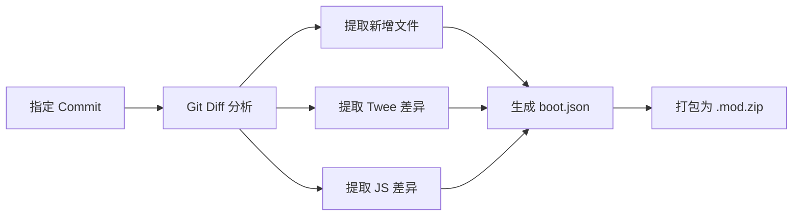
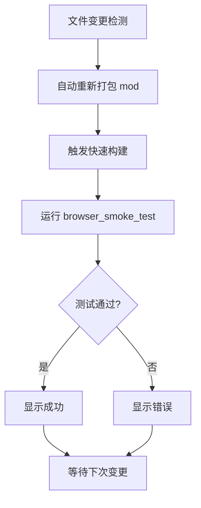

# DOL-X 开发工具指南

本文档整合社区工具使用指南和 DOL-X 自研工具，帮助开发者提升 mod 开发和测试效率。

**最后更新**: 2026-06-23  
**目标读者**: DOL-X 贡献者、mod 开发者

---

## 工具概览

### 已集成工具（可用）

| 工具 | 用途 | 状态 | 文档 |
|------|------|------|------|
| browser_smoke_test | 浏览器功能测试 | ✅ 可用 | [tools/browser_smoke_test.py](../tools/browser_smoke_test.py) |
| check_mod_updates | 检查 mod 更新 | ✅ 可用 | [tools/check_mod_updates.py](../tools/check_mod_updates.py) |
| pytest | 单元测试框架 | ✅ 可用 | [tests/](../tests/) |

### 计划集成工具（开发中）

| 工具 | 用途 | 优先级 | 计划时间 |
|------|------|--------|----------|
| commit-to-mod | 测试上游提交 | P1 | Sprint 1（本周） |
| dev_server | 热加载开发服务器 | P2 | Sprint 3（两周后） |
| game_logic_tests | 游戏逻辑测试 | P3 | Sprint 4（一个月后） |
| analyze_imagepack | 美化包分析 | P4 | Sprint 4 或后续 |

### 社区工具（参考）

| 工具 | 作者 | 用途 | 链接 |
|------|------|------|------|
| DoL-Commit2Mod | Lethivia | Commit → Mod 转换 | [GitHub](https://github.com/Lethivia/DoL-Commit2Mod) |
| DOL-Mod-Created-Helper | NumberSir | Mod 脚手架 + 测试 | [GitHub](https://github.com/NumberSir/DOL-Mod-Created-Helper) |
| DoLModRspackExampleTS | Muromi-Rikka | Rspack + TS 模板 | [GitHub](https://github.com/Muromi-Rikka/DoLModRspackExampleTS) |

---

## 已集成工具使用

### 1. browser_smoke_test - 浏览器功能测试

**用途**: 在真实浏览器中测试构建产物，验证核心功能

**使用方法**:

```bash
# 测试单个构建
python tools/browser_smoke_test.py output/DoL-XFox-ucb-more-love-cheatExtended+maplebirch-custom_hair-mae_picvary-maplebirch_expansion-499968-0.5.8.10.zip

# 测试所有构建
python tools/browser_smoke_test.py output/*.zip

# 指定浏览器
python tools/browser_smoke_test.py output/*.zip --browser chrome

# 详细日志
python tools/browser_smoke_test.py output/*.zip --verbose
```

**测试项**:
- ✅ 游戏加载成功
- ✅ ModLoader 成功加载
- ✅ 无 JavaScript 错误
- ✅ 核心 UI 元素存在

**输出示例**:
```
✅ DoL-XFox-...-499968-0.5.8.10.zip
   - Game loaded: ✅
   - ModLoader initialized: ✅
   - No JS errors: ✅
   - UI elements: ✅
   Time: 5.2s
```

---

### 2. check_mod_updates - 检查 Mod 更新

**用途**: 检查已集成 mod 的 GitHub 更新

**使用方法**:

```bash
# 检查所有 mod
python tools/check_mod_updates.py

# 检查特定 mod
python tools/check_mod_updates.py --mod maplebirch

# JSON 输出
python tools/check_mod_updates.py --format json
```

**输出示例**:
```
Checking mod updates...

maplebirch:
  Current: v3.1.14
  Latest: v4.1.8
  Status: 🔴 UPDATE AVAILABLE (但等待 expansion v1.2.5+ 支持)

expansion:
  Current: v1.2.4
  Latest: v1.2.4
  Status: ✅ UP TO DATE
```

---

### 3. pytest - 单元测试框架

**用途**: 运行自动化测试，验证代码逻辑

**使用方法**:

```bash
# 运行所有测试
pytest tests/

# 运行特定测试
pytest tests/test_build_matrix.py

# 详细输出
pytest tests/ -v

# 覆盖率报告
pytest tests/ --cov=src --cov-report=html
```

**测试类别**:
- `tests/test_build_matrix.py`: 构建矩阵验证
- `tests/test_config_validation.py`: 配置文件验证
- `tests/test_mod_compatibility.py`: Mod 兼容性（计划添加）
- `tests/test_game_logic.py`: 游戏逻辑（计划添加）

---

## 计划集成工具

### 1. commit-to-mod - 测试上游提交（Sprint 1）

**用途**: 将上游 Git commit 转换为 ModLoader 兼容的 mod，快速测试新功能

**设计**:

```bash
# 基本用法
python main.py dev commit-to-mod <commit-hash>

# 指定上游仓库
python main.py dev commit-to-mod abc1234 --repo https://github.com/DoL-Lyra/Lyra.git

# 自定义 mod 名称和版本
python main.py dev commit-to-mod abc1234 --name test_feature --version 0.1.0

# 输出
# workspace/experimental_mods/test_feature-0.1.0.mod.zip
```

**工作流程**:



**实现状态**:

| 功能 | 状态 | 备注 |
|------|------|------|
| Git diff 解析 | 🔄 研究完成 | 参考 DoL-Commit2Mod |
| Twee passage 识别 | 🔄 研究完成 | 通过 `::` 识别 passage |
| TweeReplacer 参数生成 | 🔄 研究完成 | findString + replace |
| ReplacePatcher 参数生成 | 🔄 研究完成 | from + to + fileName |
| boot.json 生成 | 🔄 研究完成 | 包含 tweeFileList + addonPlugin |
| 集成到 main.py | ⏳ 待实现 | Sprint 1 任务 |

**参考实现**: [workspace/research/DoL-Commit2Mod/main.py](../workspace/research/DoL-Commit2Mod/main.py)

**技术难点与解决方案**:

1. **Twee Passage 识别**
   - 问题：如何识别修改行所属的 passage？
   - 方案：从修改行向上搜索第一个 `::` 开头的行

2. **上下文提取**
   - 问题：TweeReplacer 需要足够的上下文才能匹配
   - 方案：提取修改前后各 2-3 行作为 findString

3. **Git Diff 解析**
   - 问题：解析 unified diff 格式
   - 方案：使用正则表达式匹配 `@@ -old,count +new,count @@`

**使用场景**:

```bash
# 场景 1：测试上游最新功能
# 1. 查看上游最新提交
git log upstream/vega --oneline --max-count=10

# 2. 转换为 mod
python main.py dev commit-to-mod a1b2c3d

# 3. 构建并测试
python main.py build --codes 499968 --extra-mods workspace/experimental_mods/a1b2c3d.mod.zip
python tools/browser_smoke_test.py output/*.zip

# 场景 2：快速验证 bug 修复
python main.py dev commit-to-mod bugfix_commit --name bugfix_test
```

---

### 2. dev_server - 热加载开发服务器（Sprint 3）

**用途**: 监控 mod 源码变更，自动重新打包并测试

**设计**:

```bash
# 启动开发服务器
python tools/dev_server.py --watch mods/my_mod --port 8080

# 多个 mod
python tools/dev_server.py --watch mods/mod1,mods/mod2

# 指定构建码
python tools/dev_server.py --watch mods/my_mod --code 499968
```

**工作流程**:



**实现计划**:

```python
# tools/dev_server.py 伪代码
import watchdog
from pathlib import Path

class ModDevServer:
    def __init__(self, watch_path, build_code, port):
        self.watch_path = Path(watch_path)
        self.build_code = build_code
        self.port = port
    
    def on_file_changed(self, event):
        print(f"📝 File changed: {event.src_path}")
        
        # 1. 重新打包 mod
        self.rebuild_mod()
        
        # 2. 快速构建游戏
        self.build_game()
        
        # 3. 运行测试
        result = self.run_tests()
        
        # 4. 显示结果
        self.display_result(result)
    
    def start(self):
        observer = Observer()
        observer.schedule(
            FileSystemEventHandler(on_modified=self.on_file_changed),
            self.watch_path,
            recursive=True
        )
        observer.start()
        print(f"🚀 Dev server started on port {self.port}")
```

**借鉴**: MCH (DOL-Mod-Created-Helper) 的 REMOTE_TEST 设计

---

### 3. game_logic_tests - 游戏逻辑测试（Sprint 4）

**用途**: 自动化验证剧情流程和 mod 功能

**设计**:

```python
# tests/test_game_logic.py
import pytest
from tools.game_test_runner import run_game_test

@pytest.mark.parametrize("build_code", ["499968", "500992"])
def test_orphanage_intro_flow(build_code):
    """测试孤儿院开场流程"""
    result = run_game_test(
        build_code=build_code,
        start_passage="Start",
        actions=[
            {"type": "wait", "seconds": 2},
            {"type": "click", "selector": "a:contains('New Game')"},
            {"type": "wait", "passage": "Characteristics"},
            {"type": "click", "selector": "a:contains('Continue')"},
            {"type": "wait", "passage": "Orphanage Intro"},
            {"type": "assert", "condition": "V.money >= 0"},
            {"type": "assert", "condition": "V.name != undefined"},
        ]
    )
    assert result["success"], result["error"]

def test_cheat_extended_menu():
    """测试 Cheat Extended 菜单可用性"""
    result = run_game_test(
        build_code="499968",
        actions=[
            {"type": "navigate", "passage": "Start"},
            {"type": "click", "selector": "#sidebar button:contains('作弊')"},
            {"type": "wait", "seconds": 1},
            {"type": "assert", "visible": ".cheat-menu"},
            {"type": "assert", "visible": "button:contains('快速言灵')"},
        ]
    )
    assert result["success"]

def test_custom_hair_functionality():
    """测试 Custom Hair 功能"""
    result = run_game_test(
        build_code="499968",
        actions=[
            {"type": "navigate", "passage": "Mirror"},
            {"type": "click", "selector": "a:contains('染发')"},
            {"type": "wait", "seconds": 1},
            {"type": "assert", "visible": "select:contains('自定义颜色')"},
        ]
    )
    assert result["success"]

def test_more_love_interests_slots():
    """测试 More Love Interests 栏位"""
    result = run_game_test(
        build_code="499968",
        actions=[
            {"type": "navigate", "passage": "Social"},
            {"type": "assert", "count": {"selector": ".love-interest-slot", "min": 10}},
        ]
    )
    assert result["success"]
```

**测试 DSL**:

| Action 类型 | 参数 | 说明 |
|------------|------|------|
| `wait` | `seconds` 或 `passage` | 等待时间或 passage 加载 |
| `click` | `selector` | 点击元素 |
| `type` | `selector`, `text` | 输入文本 |
| `assert` | `condition` 或 `visible` | 断言条件或元素可见 |
| `navigate` | `passage` | 直接导航到 passage |
| `screenshot` | `filename` | 截图（调试用） |

**实现技术**:
- 使用 Chrome DevTools Protocol (CDP) 控制浏览器
- 通过 `SugarCube.State.passage` 获取当前 passage
- 通过 `SugarCube.State.variables` 访问游戏变量

---

### 4. analyze_imagepack - 美化包分析（Sprint 4）

**用途**: 检测 imagepack 和 mod 的路径冲突

**设计**:

```bash
# 分析两个 imagepack 的重叠
python tools/analyze_imagepack.py \
  workspace/imagepacks/ucb/ \
  workspace/imagepacks/new_pack/ \
  --output overlap_report.json

# 分析 mod 与 imagepack 的冲突
python tools/analyze_imagepack.py \
  workspace/imagepacks/ucb/ \
  workspace/mods/au_face/ \
  --type mod

# 生成可视化报告
python tools/analyze_imagepack.py \
  workspace/imagepacks/ucb/ \
  workspace/imagepacks/new_pack/ \
  --output report.html --format html
```

**输出示例** (JSON):

```json
{
  "summary": {
    "total_files_a": 1250,
    "total_files_b": 850,
    "overlapping_count": 120,
    "unique_to_a": 1130,
    "unique_to_b": 730,
    "conflict_risk": "medium"
  },
  "overlapping_paths": [
    "img/sex/doggy/1.png",
    "img/combat/missionary/2.png"
  ],
  "unique_to_a": [...],
  "unique_to_b": [...],
  "conflict_analysis": {
    "img/sex/": {
      "overlap_count": 80,
      "risk": "high"
    }
  }
}
```

**可视化报告** (HTML):

```html
<!DOCTYPE html>
<html>
<head><title>Imagepack Overlap Report</title></head>
<body>
  <h1>UCB vs New Pack</h1>
  <h2>Summary</h2>
  <ul>
    <li>Total files: UCB (1250) vs New Pack (850)</li>
    <li>Overlapping: 120 files (14.1%)</li>
    <li>Conflict Risk: <span style="color:orange">MEDIUM</span></li>
  </ul>
  <h2>Overlapping Directories</h2>
  <table>
    <tr><th>Directory</th><th>Files</th><th>Risk</th></tr>
    <tr><td>img/sex/</td><td>80</td><td style="color:red">HIGH</td></tr>
    <tr><td>img/combat/</td><td>40</td><td style="color:orange">MEDIUM</td></tr>
  </table>
</body>
</html>
```

---

## 社区工具参考

### DoL-Commit2Mod (Lethivia)

**GitHub**: https://github.com/Lethivia/DoL-Commit2Mod

**用途**: 将 Git commit 转换为 ModLoader 兼容的 mod

**核心功能**:
1. 分析 commit 变更（`git diff-tree`）
2. 复制新增文件到 mod 目录
3. 提取 Twee 文件差异 → TweeReplacer 参数
4. 提取 JS 文件差异 → ReplacePatcher 参数
5. 生成 boot.json
6. 打包为 .mod.zip

**DOL-X 借鉴点**:
- ✅ Git diff 解析逻辑
- ✅ Twee passage 识别方法
- ✅ boot.json 生成模板
- ⚠️ 需改进：更好的上下文提取
- ⚠️ 需改进：支持多个 upstream 仓库

**参考代码**: [workspace/research/DoL-Commit2Mod/main.py](../workspace/research/DoL-Commit2Mod/main.py)

---

### DOL-Mod-Created-Helper (NumberSir)

**GitHub**: https://github.com/NumberSir/DOL-Mod-Created-Helper

**用途**: Mod 创建脚手架 + 自动化测试

**核心功能**:
1. **Mod 脚手架**: 快速创建 mod 项目结构
2. **REMOTE_TEST**: 远程游戏逻辑测试
   - 模拟游戏流程（passage 导航、选项点击）
   - 验证游戏状态（变量、存档）
3. **Mod 管理**: 依赖管理、版本控制

**DOL-X 借鉴点**:
- ✅ REMOTE_TEST 设计思路
- ✅ 游戏逻辑测试 DSL
- ✅ CDP (Chrome DevTools Protocol) 使用
- 🔄 计划借鉴：热加载开发服务器

**实施计划**: Sprint 3-4（dev_server 和 game_logic_tests）

---

### DoLModRspackExampleTS (Muromi-Rikka)

**GitHub**: https://github.com/Muromi-Rikka/DoLModRspackExampleTS

**用途**: 基于 Rspack + TypeScript 的 mod 开发模板

**技术栈**:
- **Rspack**: 类 Webpack 的快速构建工具
- **TypeScript**: 类型安全
- **模块化**: 现代前端工具链

**DOL-X 借鉴点**:
- 📝 推荐给 mod 开发者作为模板
- 📝 参考构建配置
- 📝 学习 ModLoader 最佳实践

**使用场景**: 开发 DOL-X 自研 mod（如兼容性 shim）

**示例项目结构**:
```
my-mod/
├── src/
│   ├── index.ts          # mod 入口
│   ├── components/       # 组件
│   └── utils/            # 工具函数
├── rspack.config.js      # 构建配置
├── boot.json             # ModLoader 元数据
├── package.json
└── README.md
```

---

## 开发工作流

### 场景 1：测试上游新功能

```bash
# 1. 查看上游最新提交
git fetch upstream
git log upstream/vega --oneline --max-count=10

# 2. 转换为 mod 测试
python main.py dev commit-to-mod <hash>

# 3. 构建并测试
python main.py build --codes 499968 --extra-mods workspace/experimental_mods/<hash>.mod.zip
python tools/browser_smoke_test.py output/*.zip

# 4. 如果测试通过，考虑合并到主分支
git cherry-pick <hash>
```

---

### 场景 2：开发自定义 mod

```bash
# 1. 使用 Rspack 模板创建项目
git clone https://github.com/Muromi-Rikka/DoLModRspackExampleTS.git my-mod
cd my-mod
npm install

# 2. 修改 mod 内容
# 编辑 src/index.ts, boot.json 等

# 3. 构建 mod
npm run build

# 4. 集成到 DOL-X
cp dist/my-mod.mod.zip /e/game/repo/DOL-X/workspace/custom_mods/
python main.py build --codes 499968 --extra-mods workspace/custom_mods/my-mod.mod.zip

# 5. 测试
python tools/browser_smoke_test.py output/*.zip
```

---

### 场景 3：热加载开发（计划功能）

```bash
# 启动开发服务器
python tools/dev_server.py --watch mods/my_mod --code 499968

# 输出：
# 🚀 Dev server started on port 8080
# 👀 Watching: mods/my_mod
# ⏳ Waiting for changes...

# [修改 mods/my_mod/src/index.ts]

# 📝 File changed: mods/my_mod/src/index.ts
# 📦 Rebuilding mod...
# ✅ Mod rebuilt: my_mod.mod.zip
# 🏗️ Building game (code: 499968)...
# ✅ Game built: output/DoL-XFox-...-499968.zip
# 🧪 Running tests...
# ✅ All tests passed!
# ⏱️ Total time: 12.3s
# ⏳ Waiting for changes...
```

---

### 场景 4：验证美化兼容性

```bash
# 分析 UCB 与新美化包的重叠
python tools/analyze_imagepack.py \
  workspace/imagepacks/ucb/ \
  workspace/imagepacks/new_beauty_pack/ \
  --output reports/overlap_ucb_vs_new.html --format html

# 打开报告查看冲突
# reports/overlap_ucb_vs_new.html

# 如果冲突可接受，添加到 build.toml
# 如果冲突严重，考虑调整加载顺序或排除冲突文件
```

---

## 相关文档

- [社区工具指南](COMMUNITY_TOOLS.md) - 社区工具完整列表
- [社区 Mod 调研](COMMUNITY_MOD_RESEARCH.md) - 候选 mod 详细信息
- [Mod 兼容性矩阵](MOD_COMPATIBILITY_MATRIX.md) - 测试结果记录
- [Mod 添加清单](MOD_ADDITION_CHECKLIST.md) - 集成流程
- [AGENTS.md](../AGENTS.md) - Agent 工作指南

---

**文档状态**: ✅ 初始版本完成  
**下次更新**: Sprint 1 完成后（commit-to-mod 实现）  
**维护者**: DOL-X 项目组
