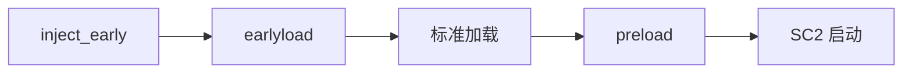

# ModLoader boot.json 完整规范

**文档版本**: 1.0  
**最后更新**: 2026-06-11  
**官方参考**: https://github.com/Lyoko-Jeremie/sugarcube-2-ModLoader/blob/master/README.md

---

## 目录

- [概述](#概述)
- [基础字段](#基础字段)
- [资源文件列表](#资源文件列表)
- [脚本加载阶段](#脚本加载阶段)
- [依赖管理](#依赖管理)
- [插件系统](#插件系统)
- [完整示例](#完整示例)

---

## 概述

`boot.json` 是 Mod 的**核心配置文件**，必须位于 `.mod.zip` 的**根目录**。

### 作用

1. 声明 Mod 的基本信息（名称、版本）
2. 指定要加载的资源文件
3. 声明依赖关系
4. 配置插件和加载顺序

### 格式要求

- **文件名**: 必须是 `boot.json`（区分大小写）
- **编码**: UTF-8
- **语法**: 标准 JSON（不支持注释）
- **位置**: ZIP 根目录（不能在子文件夹中）

---

## 基础字段

### 必需字段

#### name (必需)

Mod 的唯一标识符。

```json
{
  "name": "MyMod"
}
```

**注意事项**：
- 用于依赖检查和 Mod 查找
- 建议使用英文和下划线
- 避免特殊字符和空格

#### version (必需)

Mod 版本号。

```json
{
  "version": "1.0.0"
}
```

**建议**：
- 遵循 [semver](https://semver.org/) 规范
- 格式：`主版本.次版本.修订版本`
- 示例：`1.0.0`, `2.3.4`, `0.1.0-beta`

### 可选字段

#### nickName

用户友好的显示名称。

**写法 1：简单字符串**

```json
{
  "nickName": "My Awesome Mod"
}
```

**写法 2：多语言支持**

```json
{
  "nickName": {
    "cn": "我的超棒模组",
    "en": "My Awesome Mod",
    "jp": "私の素晴らしいMod"
  }
}
```

#### alias

Mod 别名，用于兼容性。

```json
{
  "alias": ["OldModName", "LegacyMod"]
}
```

**用途**：
- Mod 更名后保持向后兼容
- 提供多个名称供其他 Mod 查找
- 跨游戏迁移（如 maplebirch 的 `Simple Frameworks` 别名）

---

## 资源文件列表

所有资源文件路径都**相对于 ZIP 根目录**。

### styleFileList

CSS 样式文件列表。

```json
{
  "styleFileList": [
    "css/style1.css",
    "css/style2.css"
  ]
}
```

**加载时机**: 合并到 `<tw-storydata>` 后由 SC2 加载

### scriptFileList

标准 JavaScript 脚本文件。

```json
{
  "scriptFileList": [
    "js/main.js",
    "js/utils.js"
  ]
}
```

**加载时机**: 合并到 `<tw-storydata>` 后由 SC2 加载（游戏运行时）

### tweeFileList

Twee 格式的 Passage 文件。

```json
{
  "tweeFileList": [
    "passages/intro.twee",
    "passages/main.twee"
  ]
}
```

**格式**: 标准 Twee 2.x 格式

### imgFileList

图片文件列表。

```json
{
  "imgFileList": [
    "img/character/avatar.png",
    "img/items/sword.jpg"
  ]
}
```

**注意**：
- 支持格式：JPG, PNG, GIF, SVG, WebP
- 路径不要使用容易混淆的字符
- 文件会被 Base64 编码存储在内存中

### imgFileReplaceList

图片替换规则（需要 ImageLoaderHook）。

```json
{
  "imgFileReplaceList": [
    "replace_rules.json"
  ]
}
```

### additionFile

附加文本文件。

```json
{
  "additionFile": [
    "README.md",
    "changelog.txt"
  ]
}
```

**特殊规则**：
- 第一个以 `readme`（不区分大小写）开头的文件会作为 Mod 说明
- 在 ModLoader GUI 中显示

### additionBinaryFile

附加二进制文件。

```json
{
  "additionBinaryFile": [
    "data.zip",
    "assets.bin"
  ]
}
```

**与 additionFile 的区别**：
- `additionFile`: 以 UTF-8 文本读取
- `additionBinaryFile`: 以二进制格式保存

---

## 脚本加载阶段

ModLoader 提供 **4 个脚本加载阶段**，按时间顺序排列：



### 1. scriptFileList_inject_early

**最早期加载**，直接注入到 HTML DOM。

```json
{
  "scriptFileList_inject_early": [
    "init.js"
  ]
}
```

**特点**：
- **同步执行**（不等待异步操作）
- 可以访问 ModLoader API
- 用于 Mod 自身初始化

**典型用途**：
- 注册 Addon
- 设置全局变量
- 安装钩子

**示例**：

```javascript
// init.js
(function() {
  console.log('My Mod is initializing...');
  window.MyMod = {
    version: '1.0.0',
    config: {}
  };
})();
```

### 2. scriptFileList_earlyload

**早期加载**，由 ModLoader 执行并等待异步操作。

```json
{
  "scriptFileList_earlyload": [
    "earlyload.js"
  ]
}
```

**特点**：
- **支持异步**（ModLoader 会等待 Promise）
- 可以读取未修改的 Passage
- 使用特殊的执行器

**执行器行为**：

```javascript
// ModLoader 会将代码包装为：
(async () => {
  return ${jsCode}
})()
```

**重要**：由于前面有 `return`，只会执行**第一行代码或第一个闭包**。

**正确写法**：

```javascript
// earlyload.js
(async function() {
  // 所有逻辑都在这个闭包中
  console.log('Early loading...');
  await someAsyncOperation();
  console.log('Early load complete!');
})();
```

**错误写法**：

```javascript
// 错误！只会执行第一行
console.log('Line 1');
console.log('Line 2');  // 永远不会执行
```

### 3. scriptFileList (标准)

**标准加载**，合并到 `<tw-storydata>` 后由 SC2 加载。

```json
{
  "scriptFileList": [
    "main.js"
  ]
}
```

**加载时机**: SC2 编译 Story 数据时

### 4. scriptFileList_preload

**预加载**，在 SC2 启动前由 ModLoader 执行。

```json
{
  "scriptFileList_preload": [
    "preload.js"
  ]
}
```

**特点**：
- 可以读取已合并的 Passage 数据
- 可以动态修改 Passage 内容
- 支持异步操作

**典型用途**：
- 动态修改游戏脚本
- 读取其他 Mod 的数据
- 最后的初始化工作

**固定格式**（官方要求）：

```javascript
// preload.js
window.modSC2DataManager.getModLoadController().addLifeTimeCircleHook({
  ModLoaderLoadEnd: async () => {
    console.log('All mods loaded!');
    // 在这里执行预加载逻辑
  }
});
```

---

## 依赖管理

### dependenceInfo

声明 Mod 依赖关系。

```json
{
  "dependenceInfo": [
    {
      "modName": "ModLoader",
      "version": "^2.100.0"
    },
    {
      "modName": "ImageLoaderHook",
      "version": ">=2.0.0"
    },
    {
      "modName": "maplebirch",
      "version": ">=3.1.13 <4.0.0"
    }
  ]
}
```

### 版本约束语法

| 语法 | 含义 | 示例 |
|------|------|------|
| `^2.100.0` | 兼容 2.x 主版本 | 2.100.0 ~ 2.999.999 |
| `>=0.5.6` | 最低版本 | 0.5.6 及以上 |
| `>=3.1.13 <4.0.0` | 版本范围 | 3.1.13 ~ 3.999.999 |
| `*` | 任意版本（不推荐） | 所有版本 |
| `1.0.0` | 精确版本 | 仅 1.0.0 |

### 依赖检查

ModLoader 在加载时自动检查：

1. 依赖的 Mod 是否存在
2. 版本是否满足约束
3. 依赖关系是否循环

**失败处理**：
- 显示错误信息
- 阻止 Mod 加载
- 记录到加载日志

---

## 插件系统

### addonPlugin

将 Mod 注册到 Addon。

```json
{
  "addonPlugin": [
    {
      "modName": "ConflictChecker",
      "addonName": "ConflictCheckerAddon",
      "modVersion": "^1.0.0",
      "params": {
        "mustAfter": [
          {"modName": "ModLoaderGui", "version": "^1.0.0"}
        ],
        "optionalAfter": [
          {"modName": "ImageLoaderHook", "version": "*"}
        ]
      }
    }
  ]
}
```

### 字段说明

#### modName

Addon Mod 的名称（必需）。

#### addonName

Addon 插件的名称（必需）。

**示例**：
- `ConflictCheckerAddon`
- `ImageLoaderHookAddon`
- `BeautySelectorAddon`

#### modVersion

Addon Mod 的版本约束（必需）。

#### params

传递给 Addon 的参数对象。

**通用参数**：

- `mustAfter`: 必须在这些 Mod 之后加载
- `optionalAfter`: 如果存在，则在这些 Mod 之后

**Addon 特定参数**：

每个 Addon 可能有自己的参数，参考对应 Addon 的文档。

---

## 完整示例

### 示例 1：简单 Mod

```json
{
  "name": "MySimpleMod",
  "version": "1.0.0",
  "nickName": "My Simple Mod",
  "styleFileList": ["style.css"],
  "scriptFileList": ["main.js"],
  "tweeFileList": ["passages.twee"],
  "imgFileList": [],
  "additionFile": ["README.md"],
  "dependenceInfo": [
    {"modName": "ModLoader", "version": "^2.0.0"}
  ]
}
```

### 示例 2：复杂 Mod (maplebirch 风格)

```json
{
  "name": "maplebirch",
  "version": "3.1.13",
  "nickName": {
    "cn": "秋枫白桦框架",
    "en": "Maplebirch Framework"
  },
  "alias": ["Simple Frameworks"],
  "scriptFileList_inject_early": [
    "dist/inject_early/init.js"
  ],
  "scriptFileList_earlyload": [
    "dist/earlyload/earlyload.js"
  ],
  "scriptFileList_preload": [
    "dist/preload/preload.js"
  ],
  "scriptFileList": [
    "dist/main.js"
  ],
  "styleFileList": [
    "dist/style.css"
  ],
  "tweeFileList": [],
  "imgFileList": [],
  "additionFile": ["README.md", "CHANGELOG.md"],
  "dependenceInfo": [
    {"modName": "ModLoader", "version": "^2.0.0"},
    {"modName": "ModLoaderGui", "version": "^1.9.0"},
    {"modName": "BeautySelectorAddon", "version": "^2.9.0"}
  ],
  "addonPlugin": [
    {
      "modName": "ConflictChecker",
      "addonName": "ConflictCheckerAddon",
      "modVersion": "^1.0.0",
      "params": {
        "mustAfter": [
          {"modName": "ConflictChecker", "version": "^1.0.0"}
        ],
        "optionalAfter": [
          {"modName": "ModLoaderGui", "version": "^1"}
        ]
      }
    }
  ]
}
```

### 示例 3：图片 Mod

```json
{
  "name": "MyImagePack",
  "version": "2.0.0",
  "nickName": "My Image Pack",
  "styleFileList": [],
  "scriptFileList": [],
  "tweeFileList": [],
  "imgFileList": [
    "img/characters/npc01.png",
    "img/characters/npc02.png",
    "img/items/sword.jpg",
    "img/items/shield.jpg"
  ],
  "imgFileReplaceList": [
    "replace_rules.json"
  ],
  "additionFile": ["README.md"],
  "dependenceInfo": [
    {"modName": "ModLoader", "version": "^2.0.0"},
    {"modName": "ImageLoaderHook", "version": "^2.0.0"}
  ]
}
```

---

## 常见错误

### 错误 1：boot.json 不在根目录

```
❌ MyMod.mod.zip
    └── MyMod/
        └── boot.json

✅ MyMod.mod.zip
    └── boot.json
```

### 错误 2：JSON 语法错误

```json
// ❌ 错误：有注释
{
  "name": "MyMod",  // 这是注释
  "version": "1.0.0"
}

// ✅ 正确：无注释
{
  "name": "MyMod",
  "version": "1.0.0"
}
```

### 错误 3：字段拼写错误

```json
// ❌ 错误
{
  "name": "MyMod",
  "version": "1.0.0",
  "scriptFiles": ["main.js"]  // 应该是 scriptFileList
}

// ✅ 正确
{
  "name": "MyMod",
  "version": "1.0.0",
  "scriptFileList": ["main.js"]
}
```

---

## 验证工具

### 手动验证

```bash
# 检查 boot.json 语法
python -m json.tool boot.json

# 检查 ZIP 结构
unzip -l MyMod.mod.zip | grep boot.json
```

### DOL-X 工具

```bash
# 完整 Mod 审计
python tools/mod_audit.py --output-dir output

# 检查单个 Mod
python tools/mod_audit.py --mod-path MyMod.mod.zip
```

---

## 下一步

- 了解生命周期 → [MODLOADER_LIFECYCLE.md](MODLOADER_LIFECYCLE.md)
- 查看 API 文档 → [MODLOADER_API.md](MODLOADER_API.md)
- 学习最佳实践 → [MODLOADER_BEST_PRACTICES.md](MODLOADER_BEST_PRACTICES.md)

---

## 参考资料

- **官方 README**: https://github.com/Lyoko-Jeremie/sugarcube-2-ModLoader/blob/master/README.md
- **模板项目**: https://github.com/Lyoko-Jeremie/DoLModWebpackExampleTs
- **DOL-X 示例**: [`config/build.toml`](../config/build.toml)
