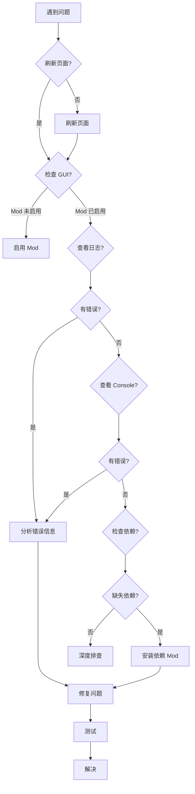

# ModLoader 常见问题解答 (FAQ)

**文档版本**: 1.0  
**最后更新**: 2026-06-11  

---

## 目录

- [基础问题](#基础问题)
- [Mod 加载问题](#mod-加载问题)
- [依赖和兼容性](#依赖和兼容性)
- [开发问题](#开发问题)
- [DOL-X 特定问题](#dol-x-特定问题)

---

## 基础问题

### Q1: 什么是 ModLoader？

**A**: ModLoader 是为 SugarCube2 游戏引擎设计的 Mod 加载和管理框架，让玩家无需修改游戏本体即可加载 Mod。

**详细**: 见 [MODLOADER_OVERVIEW.md](MODLOADER_OVERVIEW.md)

### Q2: SweetAlert2Mod 从哪里来？

**A**: **SweetAlert2Mod 是 ModLoader 的官方内置 Mod**，封装了 [SweetAlert2](https://sweetalert2.github.io/) 弹窗库。

**位置**: 
- GitHub: https://github.com/Lyoko-Jeremie/SweetAlert2Mod
- 类型: Built-in
- 状态: Stable

**用途**:
- 提供美化的弹窗 API
- 用于密码输入（如加密 Mod）
- 替代原生 JavaScript `alert()`

**不需要手动安装**: 如果游戏包含 ModLoader，SweetAlert2Mod 通常已经内置。

### Q3: 如何检查 ModLoader 版本？

**A**: 在浏览器 Console 中执行：

```javascript
console.log(window.modUtils.getModLoaderVersion());
```

### Q4: 安全模式是什么？如何触发？

**A**: 安全模式是 ModLoader 的故障恢复机制。

**触发条件**: 连续 3 次加载失败

**行为**:
1. 自动禁用所有 Mod
2. 显示警告信息
3. 允许打开 Mod 管理器
4. 可以排查故障 Mod

**退出安全模式**: 修复问题后刷新页面

---

## Mod 加载问题

### Q5: boot.json 无效？提示找不到？

**A**: 检查以下几点：

1. **文件名**: 必须是 `boot.json`（小写，区分大小写）
2. **位置**: 必须在 ZIP **根目录**，不能在子文件夹
3. **语法**: 检查 JSON 语法是否正确

**验证方法**:

```bash
# 检查 ZIP 结构
unzip -l MyMod.mod.zip | head -10

# 验证 JSON 语法
python -m json.tool boot.json
```

**常见错误**:

```
❌ MyMod.mod.zip
    └── MyMod/
        └── boot.json    # 错误：在子文件夹中

✅ MyMod.mod.zip
    └── boot.json        # 正确：在根目录
```

### Q6: Mod 加载后不生效？

**A**: 按顺序检查：

1. **刷新页面**: 加载 Mod 后需要刷新
2. **检查启用状态**: 在 ModLoader GUI 中确认 Mod 已勾选
3. **查看加载日志**: ModLoader GUI → 日志
4. **检查依赖**: 确认所有依赖 Mod 都已加载
5. **Console 错误**: 打开浏览器 DevTools 查看错误

### Q7: ModOrderContainer getByNameOne() 找不到 Mod？

**A**: 这是**常见的警告信息**，有几种情况：

#### 情况 1: 可选依赖（非致命）

```javascript
// cheatExtended 的可选查找
ModOrderContainer.getByNameOne('Simple Frameworks')
// 如果找不到，仅输出警告，不影响功能
```

**解决**: 无需解决，这是正常行为。

#### 情况 2: Mod 未启用

**解决**: 在 ModLoader GUI 中启用对应 Mod

#### 情况 3: 名称拼写错误

```javascript
// ❌ 错误
window.modUtils.getMod('maplebrch')  // 拼写错误

// ✅ 正确
window.modUtils.getMod('maplebirch')
```

#### 情况 4: Mod 真的不存在

**解决**: 安装缺失的 Mod

---

## 依赖和兼容性

### Q8: "maplebirch" 和 "Simple Frameworks" 有什么关系？

**A**: **它们是两个不同的框架，但有兼容性设计**。

**maplebirch**:
- 作者: MaplebirchLeaf
- 仓库: https://github.com/MaplebirchLeaf/SCML-DOL-maplebirchframework
- 别名: `["Simple Frameworks"]`

**Simple Frameworks**:
- 作者: emicoto
- 原始实现

**关键点**:
- maplebirch 声明了 `alias: ["Simple Frameworks"]`
- 但**API 不完全相同**
- 槽位名称不同（`'Options'` vs `'iModOptions'`）

**实战案例**: AU 面部扩展

```json
{
  "dependenceInfo": [
    {"modName": "ModLoader", "version": "^2.5.1"},
    {"modName": "SweetAlert2Mod", "version": "^1.0.0"}
    // 未声明 maplebirch，但实际需要
  ]
}
```

**详细分析**: 见 [AU_FACIAL_DEPENDENCY_REPORT.md](../AU_FACIAL_DEPENDENCY_REPORT.md)

### Q9: cheatExtended 为什么报 Simple Frameworks 找不到？

**A**: **这是已知的兼容性问题，但不影响功能**。

**原因**:
1. cheatExtended 运行时探测框架
2. 先检测 `maplebirch`（成功）
3. 再检测 `Simple Frameworks`（失败，因为是 alias）
4. Console 输出警告

**实际情况**:
- maplebirch 提供了 `Simple Frameworks` 别名
- cheatExtended 找到 maplebirch 后正常工作
- 警告可以忽略

**验证方法**:

```javascript
// 在 Console 中
console.log(window.maplebirchFrameworks);  // 应该是 object
```

**详细**: 见 [FRAMEWORK_PROVIDER_RESEARCH.md](../FRAMEWORK_PROVIDER_RESEARCH.md)

### Q10: 如何知道我需要哪些依赖？

**A**: 
1. **查看 Mod 的 README.md**
2. **检查 boot.json 的 `dependenceInfo`**
3. **查看 ModLoader GUI 的依赖信息**
4. **运行 DOL-X 的 mod_audit.py**

```bash
python tools/mod_audit.py --output-dir output
```

---

## 开发问题

### Q11: earlyload 脚本只执行第一行？

**A**: **这是设计行为**，由执行器实现决定。

**原因**: ModLoader 将代码包装为：

```javascript
(async () => {
  return ${jsCode}
})()
```

由于有 `return`，只会执行第一行或第一个表达式。

**解决方案**: 将所有代码放在一个闭包中

```javascript
// ❌ 错误
console.log('Line 1');
console.log('Line 2');  // 不会执行

// ✅ 正确
(async function() {
  console.log('Line 1');
  console.log('Line 2');
  await someAsyncOperation();
})();
```

**详细**: 见 [MODLOADER_BOOT_JSON.md](MODLOADER_BOOT_JSON.md#scriptfilelistearlyload)

### Q12: 如何调试 Mod 加载过程？

**A**: 使用浏览器 DevTools + ModLoader GUI

#### 步骤 1: 查看加载日志

1. 打开 ModLoader GUI（左下角）
2. 点击"日志"标签
3. 查看加载顺序和错误

#### 步骤 2: Console 拦截

```javascript
// 拦截 getMod 调用
(function() {
  const original = window.modUtils.getMod;
  window.modUtils.getMod = function(name) {
    console.log('[DEBUG] getMod:', name);
    const result = original.apply(this, arguments);
    console.log('[DEBUG] Result:', result ? 'found' : 'not found');
    return result;
  };
})();
```

#### 步骤 3: 断点调试

1. 打开 DevTools → Sources
2. 搜索你的脚本文件名
3. 设置断点
4. 刷新页面

### Q13: 如何让我的 Mod 在特定 Mod 之后加载？

**A**: 使用 `addonPlugin.params.mustAfter`

```json
{
  "addonPlugin": [
    {
      "modName": "ConflictChecker",
      "addonName": "ConflictCheckerAddon",
      "modVersion": "^1.0.0",
      "params": {
        "mustAfter": [
          {"modName": "FrameworkMod", "version": "^1.0.0"}
        ]
      }
    }
  ]
}
```

**注意**: 需要依赖 ConflictChecker Addon

### Q14: 图片不显示？

**A**: 检查以下几点：

1. **使用 ImageLoaderHook**:

```json
{
  "dependenceInfo": [
    {"modName": "ImageLoaderHook", "version": "^2.0.0"}
  ]
}
```

2. **在 imgFileList 中注册**:

```json
{
  "imgFileList": [
    "img/character.png"
  ]
}
```

3. **路径正确**: 相对于 ZIP 根目录
4. **文件格式**: 支持 JPG, PNG, GIF, SVG, WebP
5. **避免特殊字符**: 路径中不要有中文或特殊符号

---

## DOL-X 特定问题

### Q15: DOL-X 的 build_code 是什么？

**A**: build_code 是 DOL-X 的 **Mod 组合标识**。

**示例**:

```toml
# config/combinations.toml
build_codes = ["24834", "58114", "59138", "61186"]
```

**bit 组成**:

| Feature | Bit | 说明 |
|---------|-----|------|
| cheat_csd | 2 | 作弊 CSD |
| ucb | 256 | 通用战斗美化 |
| au-f | 1024 | AU Female |
| maplebirch | 32768 | 秋枫白桦框架 |

**计算**:
- 24834 = 256 + 8192 + 16384 + 2 (UCB + more_love + custom_spellbook + cheat_csd)
- 58114 = 24834 + 32768 + 1024 (上述 + maplebirch + AU-F)

**详细**: 见 [MIGRATION_NOTICE.md](../MIGRATION_NOTICE.md)

### Q16: 如何在 DOL-X 中添加新 Mod？

**A**: 编辑 `config/build.toml`

```toml
[[modloader_mods]]
key = "my_mod"
name = "My Mod"
github_repo = "author/repo"
release_tag = "v1.0.0"
download_url = "https://..."  # 可选
feature_ids = ["my_feature"]  # 可选
enabled = true
```

**验证**:

```bash
python tools/mod_audit.py --output-dir output
```

### Q17: AU 面部扩展为什么需要 maplebirch？

**A**: **实际测试发现必需，虽然 boot.json 未声明**。

**证据**:
- 官方文档："与秋枫白桦框架共通使用效果更佳"
- 手动测试：无框架时贴图错误，有框架时正常
- boot.json：未在 `dependenceInfo` 中声明

**解决**: DOL-X 已在所有 AU variant 中添加 maplebirch

```toml
# 新的 build codes（包含 maplebirch）
build_codes = ["24834", "58114", "59138", "61186"]
```

**详细报告**: [AU_FACIAL_DEPENDENCY_REPORT.md](../AU_FACIAL_DEPENDENCY_REPORT.md)

### Q18: DOL-X 的测试工具有哪些？

**A**: 

| 工具 | 用途 |
|------|------|
| mod_audit.py | 检查 Mod 配置和依赖 |
| browser_smoke_test.py | 浏览器自动化测试 |
| html_smoke_test.py | 静态 HTML 检查 |
| canary_payload_introspect.py | Payload 深度分析 |
| baseline_candidate_gate.py | 门控测试 |

**使用示例**:

```bash
# Mod 审计
python tools/mod_audit.py --output-dir output

# Browser 测试
python tools/browser_smoke_test.py output/*.zip --profile au-f-standard

# HTML 静态检查
python tools/html_smoke_test.py output/*.html
```

---

## 故障排除流程

### 通用排查步骤



---

## 获取帮助

### 社区资源

1. **官方 Issues**: https://github.com/Lyoko-Jeremie/sugarcube-2-ModLoader/issues
2. **DOL-X Issues**: https://github.com/XFoxLG/DOL-X/issues
3. **DoL 社区**: 百度贴吧、Reddit r/DegreesOfLewdity
4. **DoL Wiki**: https://dolmodding.miraheze.org/wiki/ModLoader

### 报告问题时提供

1. **ModLoader 版本**: `window.modUtils.getModLoaderVersion()`
2. **游戏版本**: 见游戏标题或版本号
3. **Mod 列表**: 截图 ModLoader GUI
4. **错误信息**: Console 截图或日志
5. **重现步骤**: 如何触发问题

---

## 相关文档

- [概述](MODLOADER_OVERVIEW.md) - ModLoader 简介
- [boot.json 规范](MODLOADER_BOOT_JSON.md) - 配置文件详解
- [API 文档](MODLOADER_API.md) - 开发者 API
- [最佳实践](MODLOADER_BEST_PRACTICES.md) - 开发建议

---

## 持续更新

本 FAQ 基于 DOL-X 项目实践和社区反馈持续更新。

**贡献问题**: 如果你有新的常见问题，欢迎提交 Issue 或 PR。
