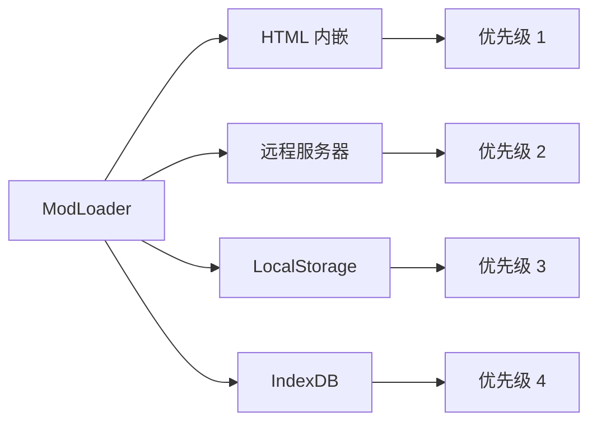
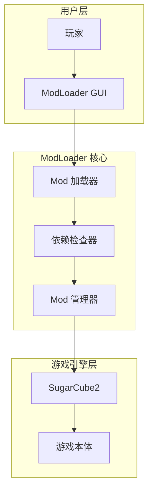

# ModLoader 概述

**文档版本**: 1.0  
**最后更新**: 2026-06-11  
**官方仓库**: https://github.com/Lyoko-Jeremie/sugarcube-2-ModLoader

---

## 目录

- [项目简介](#项目简介)
- [核心能力](#核心能力)
- [架构设计](#架构设计)
- [与 SugarCube2 的关系](#与-sugarcube2-的关系)
- [快速开始](#快速开始)

---

## 项目简介

### 什么是 ModLoader？

ModLoader 是为 **SugarCube2** 游戏引擎设计的 Mod 加载和管理框架，最初为 **Degrees of Lewdity (DoL)** 游戏开发。

**核心目标**：
- 让玩家无需修改游戏本体即可加载 Mod
- 提供统一的 Mod 管理界面
- 支持多种 Mod 来源（本地、远程、IndexDB）

### 作者和维护

**主要开发者**: Lyoko-Jeremie  
**授权协议**: 双授权（见 LICENSE 和 LICENSE2.txt）  
**社区**: GitHub Issues + DoL 社区（贴吧、Reddit）

---

## 核心能力

### 1. Mod 加载方式

ModLoader 支持 4 种 Mod 来源：



**加载优先级**：HTML > 远程 > LocalStorage > IndexDB

### 2. Mod 管理功能

通过 **ModLoaderGui**（左下角）提供：

- ✅ 启用/禁用 Mod
- ✅ 调整加载顺序
- ✅ 查看 Mod 信息和依赖
- ✅ 查看加载日志
- ✅ 导入 Mod ZIP 文件
- ✅ 安全模式（故障恢复）

### 3. 依赖管理

自动检查 Mod 依赖关系：

```json
{
  "dependenceInfo": [
    {"modName": "ModLoader", "version": "^2.100.0"},
    {"modName": "ImageLoaderHook", "version": "^2.0.0"}
  ]
}
```

**支持的版本约束**：
- `^2.100.0` - 兼容 2.x 主版本
- `>=0.5.6` - 最低版本要求
- `>=3.1.13 <4.0.0` - 版本范围

### 4. 插件系统 (Addon)

允许 Mod 扩展 ModLoader 本身：

```javascript
// 注册 Addon
AddonPluginManager.registerAddonPlugin('MyAddon', {
  // 实现钩子
  afterEarlyLoad() { /* ... */ },
  beforePatchModToGame() { /* ... */ }
});
```

**官方 Addon 示例**：
- ConflictChecker - 冲突检查
- ImageLoaderHook - 图片替换
- BeautySelectorAddon - 美化切换
- TweeReplacer - Passage 替换

---

## 架构设计

### 三层架构



### 设计理念

**低耦合原则**：
- ModLoader 核心与游戏逻辑分离
- 通用功能作为 Addon 提供
- Mod 之间互不干扰（除非显式依赖）

**扩展性优先**：
- 插件化架构
- 钩子点丰富
- API 开放透明

**安全第一**：
- 安全模式自动恢复
- 依赖检查防止冲突
- 加载失败不影响游戏本体

---

## 与 SugarCube2 的关系

### SugarCube2 简介

**SugarCube2** 是流行的文本冒险游戏引擎（基于 Twine）。

特点：
- 全同步渲染（无异步操作）
- 游戏脚本内嵌在 HTML 的 `<tw-storydata>` 节点
- 使用 Macro 和 Widget 系统

### ModLoader 的修改

为了实现 Mod 加载，ModLoader 对 SC2 做了**最小化侵入修改**：

#### 1. 启动点拦截

**修改位置**: `sugarcube.js#L111`

```javascript
// 原始 SC2 启动
jQuery(() => {
  // SC2 启动代码
});

// ModLoader 修改后
jQuery(() => {
  return new Promise(async (resolve) => {
    // ModLoader 启动并加载所有 Mod
    await ModLoader.startInit();
    resolve();
  }).then(() => {
    // SC2 正常启动
  });
});
```

**目的**: 让 ModLoader 在 SC2 启动前完成所有 Mod 加载工作。

#### 2. Wikifier 扩展

添加 `_lastPassageQ` 用于跟踪编译层级。

**影响文件**:
- `macrolib.js`
- `parserlib.js`
- `wikifier.js`

**目的**: 支持 Addon (如 TweePrefixPostfix) 动态修改编译过程。

#### 3. 资源拦截

拦截 `` 和 `<svg>` 标签加载。

**目的**: 从内存加载图片，实现完全无服务器运行。

### 兼容性

**完全兼容**：
- 所有原版 SC2 游戏特性
- 所有 Macro 和 Widget
- 所有 Passage 和 Story 格式

**增强功能**：
- Mod 加载不影响原版游戏
- 可以随时启用/禁用 Mod
- 安全模式确保游戏可玩

---

## 快速开始

### 玩家：如何使用 Mod

#### 1. 获取带 ModLoader 的游戏

**选项 A**: 下载预构建版本
- https://github.com/Lyoko-Jeremie/DoLModLoaderBuild/releases

**选项 B**: 使用整合包（推荐）
- DOL-X: https://github.com/XFoxLG/DOL-X
- DoL-Lyra: https://github.com/DoL-Lyra/Lyra

#### 2. 加载 Mod

**方法 1**: 通过 ModLoader GUI
1. 打开游戏
2. 点击左下角 "ModLoader" 按钮
3. 点击 "加载 Mod ZIP"
4. 选择 `.mod.zip` 文件
5. 刷新页面

**方法 2**: 拖放到浏览器
1. 打开游戏
2. 直接拖放 `.mod.zip` 到浏览器窗口
3. 确认加载
4. 刷新页面

#### 3. 管理 Mod

在 ModLoader GUI 中：
- **启用/禁用**: 勾选/取消勾选 Mod
- **调整顺序**: 拖动 Mod 排序
- **查看信息**: 点击 Mod 名称
- **删除 Mod**: 点击删除按钮

### 开发者：如何创建 Mod

#### 最简 Mod 结构

```
MyMod.mod.zip
├── boot.json          # Mod 配置（必需）
├── README.md          # 说明文档（推荐）
└── my_script.js       # 功能脚本
```

#### 最简 boot.json

```json
{
  "name": "MyMod",
  "version": "1.0.0",
  "styleFileList": [],
  "scriptFileList": ["my_script.js"],
  "tweeFileList": [],
  "imgFileList": [],
  "additionFile": ["README.md"]
}
```

#### 打包 Mod

**方法 1**: 手动打包
```bash
# 确保 boot.json 在 ZIP 根目录
zip -r MyMod.mod.zip boot.json my_script.js README.md
```

**方法 2**: 使用模板项目
- TypeScript: https://github.com/Lyoko-Jeremie/DoLModWebpackExampleTs
- JavaScript: https://github.com/Lyoko-Jeremie/DoLModWebpackExampleJs

---

## 相关文档

### 核心文档（本系列）

1. **[MODLOADER_OVERVIEW.md](MODLOADER_OVERVIEW.md)** - 概述（本文档）
2. **[MODLOADER_ARCHITECTURE.md](MODLOADER_ARCHITECTURE.md)** - 架构原理
3. **[MODLOADER_BOOT_JSON.md](MODLOADER_BOOT_JSON.md)** - boot.json 规范
4. **[MODLOADER_API.md](MODLOADER_API.md)** - API 文档
5. **[MODLOADER_LIFECYCLE.md](MODLOADER_LIFECYCLE.md)** - 生命周期详解
6. **[MODLOADER_BEST_PRACTICES.md](MODLOADER_BEST_PRACTICES.md)** - 最佳实践
7. **[MODLOADER_FAQ.md](MODLOADER_FAQ.md)** - 常见问题

### 官方文档

- **GitHub**: https://github.com/Lyoko-Jeremie/sugarcube-2-ModLoader
- **中文流程**: ModLoaderAndModLoadingProcess - CN.md
- **README**: 完整的 900+ 行说明

### DOL-X 相关

- **Mod 配置**: [`config/build.toml`](../config/build.toml)
- **扩展提案**: [`MODLOADER_METADATA_EXTENSION.md`](MODLOADER_METADATA_EXTENSION.md)
- **框架研究**: [`FRAMEWORK_PROVIDER_RESEARCH.md`](../FRAMEWORK_PROVIDER_RESEARCH.md)

---

## 版本历史

| 版本 | 日期 | 主要变化 |
|------|------|----------|
| 2.100.0 | 2024+ | 当前稳定版，GUI 改进 |
| 2.0.0 | 2023 | 重构架构，Addon 系统 |
| 1.x | 2022 | 初始版本 |

**检查版本**：
```javascript
// 在浏览器 Console 中
console.log(window.modUtils.getModLoaderVersion());
```

---

## 社区和支持

### 获取帮助

1. **官方 Issues**: https://github.com/Lyoko-Jeremie/sugarcube-2-ModLoader/issues
2. **DoL 社区**: 百度贴吧、Reddit r/DegreesOfLewdity
3. **DOL-X Issues**: https://github.com/XFoxLG/DOL-X/issues

### 贡献

ModLoader 是开源项目，欢迎：
- 报告 Bug
- 提交功能建议
- 贡献代码（PR）
- 编写文档

---

## 下一步

- 了解架构原理 → [MODLOADER_ARCHITECTURE.md](MODLOADER_ARCHITECTURE.md)
- 学习创建 Mod → [MODLOADER_BOOT_JSON.md](MODLOADER_BOOT_JSON.md)
- 查看 API 文档 → [MODLOADER_API.md](MODLOADER_API.md)
- 查看实战案例 → [MODLOADER_FAQ.md](MODLOADER_FAQ.md)
